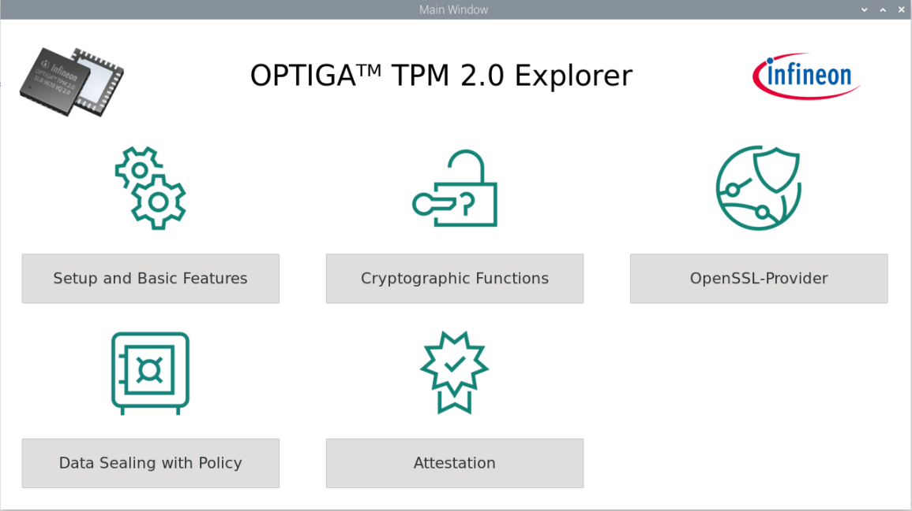

# OPTIGA™ TPM 2.0 Explorer

The OPTIGA™ TPM 2.0 Explorer is a GUI-based tool for users to familiarize themselves with TPM 2.0 quickly and easily using Infineon's OPTIGA™ TPM 2.0 solution for Raspberry Pi. In addition, the OPTIGA™ TPM 2.0 Explorer demonstrates how the OPTIGA™ TPM 2.0 can be used to increase security and trust for data sharing across different networking and cloud platforms.

Using this tool, you can instantly experience the benefits that [OPTIGA™ TPM 2.0](https://www.infineon.com/cms/en/product/security-smart-card-solutions/optiga-embedded-security-solutions/optiga-tpm/?redirId=39899/) will bring to IoT devices and network equipment.

|  |
| ------------------------------------------------------- |

## Features

-   Shows OPTIGA™ TPM 2.0 commands executed and the corresponding responses on the display screen or the terminal in the background
-   Displays all properties defined within an OPTIGA™ TPM 2.0
-   Initializes an OPTIGA™ TPM 2.0
-   Resets back to default settings
-   Manages the authorization values for the owner, endorsement and lockout
-   Manages OPTIGA™ TPM 2.0 NV memory for creating, deleting, reading, writing, listing, etc.
-   Handles PCR indexes by listing all the different registers in SHA-1 or SHA-256 or SHA-384
-   Handles PCR indexes by extending a value to the registers in SHA-1 or SHA-256 or SHA-384 using PCR Extend/Event
-   Manages specific handles and contexts associated with transient and persistent objects
-   Configures dictionary attack settings such as the number of attempts before lockout as well as the time required for recovery from failure and from lockout
-   Creates RSA-2048 and ECC-P256 primary and secondary keys under storage hierarchy
-   Encrypts and decrypts data using RSA-2048
-   Signs and verifies data with RSA-2048 and ECC-P256
-   Data seal and unseal with policy
-   Attestation with Endorsement Key
-   ECC and RSA cryptographic operations using OpenSSL provider
-   Secured TLS communications with OpenSSL provider

## Setup environment

For more information on how to setup the tool environment, refer to the [OPTIGA™ TPM 2.0 Explorer Setup Guide](./Setup%20Guide.md)

## User guide

Learn more about the tool, how it works and OPTIGA™ TPM 2.0 functionality by the following example illustrations and simple step-by-step instructions;  see the [OPTIGA™ TPM 2.0 Explorer User Guide](./User%20Guide.md) for details.

## Resources

You will find relevant resources (tools, open source host code and application notes) to help you study OPTIGA™ TPM2.0 and learn more about it on [Infineon OPTIGA™ TPM2.0 GitHub Repo.](https://github.com/Infineon/optiga-tpm)

## License

The OPTIGA™ TPM 2.0 Explorer is released under the MIT License; see the [LICENSE](LICENSE) file for details.

