# **OPTIGA™ TPM 2.0 Explorer User Guide**


This page helps you explore the tool to accelerate your learning about OPTIGA™ TPM 2.0. 

1. [Overview](#overview)
    - [1.1 Features](#features)
    - [1.2 Use cases](#use-cases)
    - [1.3 Setup environment](#setup-environment)
2.  [Setup and Basic Features](#setup-and-basic-features)
    - [2.1 Setup](#setup)
        - [2.1.1 OPTIGA™ TPM Setup Functions](#optiga-tpm-setup-functions)
        - [2.1.2 TPM Startup](#tpm-startup)
        - [2.1.3 Viewing TPM (fixed) Capabilities](#viewing-tpm-fixed-capabilities)
        - [2.1.4 Changing Authorization values of TPM](#changing-authorization-values-of-tpm)
        - [2.1.5 Dictionary Attack](#dictionary-attack)
        - [2.1.6 TPM ClearLock](#tpm-clearlock)
    - [2.2 Platform Configuration Registers](#platform-configuration-registers)
        - [2.2.1 Platform Configuration Registers Functions](#platform-configuration-registers-functions)
        - [2.2.2 PCR Listing](#pcr-listing)
        - [2.2.3 PCR Extend and PCR Event](#pcr-extend-and-pcr-event)
    - [2.3 NVM and Certificate Management](#nvm-and-certificate-management)
        - [2.3.1 NVM and Certificate Management Functions](#nvm-and-certificate-management-functions)
        - [2.3.2 NV Define](#nv-define)
        - [2.3.3 NV Write](#nv-write)
        - [2.3.4 Reading Cerificiate](#reading-cerificiate)
        - [2.3.5 Writing File](#writing-file)
        - [2.3.6 NV Release](#nv-release)
    - [2.4 Handle Mangement](#handle-mangement)
        - [2.4.1 Handle Management Functions](#handle-management-functions)
        - [2.4.2 Handle Management List All](#handle-management-list-all)
        - [2.4.3 Handle Management Evict Persistent](#handle-management-evict-persistent)
3.  [Cryptographic Functions](#cryptographic-functions)
    - [3.1 Hash Cryptographic Functions](#hash-cryptographic-functions)
    - [3.2 RSA Cryptographic Functions](#rsa-cryptographic-functions)
        - [3.2.1 RSA Cryptographic Function Description](#rsa-cryptographic-function-description)
        - [3.2.2 Creating RSA Keypair](#creating-rsa-keypair)
        - [3.2.3 Encrypting and Decrypting RSA](#encrypting-and-decrypting-rsa)
        - [3.2.4 Signing and Verifying RSA](#signing-and-verifying-rsa)
     - [3.3 ECC Cryptographic Functions](#ecc-cryptographic-functions)
        - [3.3.1 ECC Cryptographic Function Description](#ecc-cryptographic-function-description)
        - [3.3.2 Creating ECC Keypair](#creating-ecc-keypair)
        - [3.3.3 Signing and Verifying ECC](#signing-and-verifying-ecc)
4.  [OpenSSL Engine](#openssl-engine)
    - [4.1 RSA (Enc/Dec/Sign/Verify)](#rsa-encdecsignverify)
        - [4.1.1 RSA (Enc/Dec/Sign/Verify) Function Description](#rsa-encdecsignverify-function-description)
        - [4.1.1.1 RSA Encryption and Decryption](#rsa-encryption-and-decryption)
        - [4.1.1.2 RSA Signing and Verification](#rsa-signing-and-verification)
    - [4.2 Random Number Generator](#random-number-generator)
    - [4.3 RSA (Client/Server)](#rsa-clientserver)
        - [4.3.1 RSA (Client/Server) Function Description](#rsa-clientserver-function-description)
        - [4.3.2 Create Root CA and Its Certificate](#create-root-ca-and-its-certificate)
        - [4.3.3 Create Server Certificate](#create-server-certificate)
        - [4.3.4 Create an OpenSSL Server](#create-an-openssl-server)
        - [4.3.5 Create an OpenSSL Client](#create-an-openssl-client)
        - [4.3.6 Secure data exchange between Server and Client](#secure-data-exchange-between-server-and-client)
    - [4.4 ECC (Client/Server)](#ecc-clientserver)
        - [4.4.1 ECC (Client/Server) Function Description](#ecc-clientserver-function-description)
        - [4.4.2 Create Root CA and Its Certificate](#create-root-ca-and-its-certificate-1)
        - [4.4.3 Create Server Certificate](#create-server-certificate-1)
        - [4.4.4 Create an OpenSSL Server](#create-an-openssl-server-1)
        - [4.4.5 Creating an OpenSSL Client](#creating-an-openssl-client)
        - [4.4.6 Secure data exchange between Server and client](#secure-data-exchange-between-server-and-client-1)
5.  [Data Sealing with Policy](#data-sealing-with-policy)
    - [5.1 Data Sealing with Policy Function Description](#data-sealing-with-policy-function-description)
    - [5.2 Data Sealing with Policy Functions](#data-sealing-with-policy-functions)
        - [5.2.1 Data Sealing with Policy](#data-sealing-with-policy-1)
6.  [Attestation](#attestation)
    - [6.1 Attestation Function Description](#attestation-function-description)
    - [6.2 Generating Quote](#generating-quote)
    - [6.3 Verifying Quote](#verifying-quote)
    - [6.4 Evict AK/EK Handle](#evict-akek-handle)
7.  [Secured connection to AWS IoT core using TPM2.0](#secured-connection-to-aws-iot-core-using-tpm20)
    - [7.1 Get started with AWS IoT Core](#get-started-with-aws-iot-core)
    - [7.2 Create device certificate and assign it to Thing with policy](#create-device-certificate-and-assign-it-to-thing-with-policy)
    - [7.3 Publish messages to AWS IoT core from the Raspberry Pi](#publish-messages-to-aws-iot-core-from-the-raspberry-pi)
8.  [References](#references)

# Overview

The OPTIGA™ TPM 2.0 Explorer is a GUI-based tool for users to familiarize themselves with TPM 2.0 quickly and easily using Infineon's OPTIGA™ TPM 2.0 solution for Raspberry Pi. In addition, the OPTIGA™ TPM 2.0 Explorer demonstrates how the OPTIGA™ TPM 2.0 can be used to increase security and trust for data sharing across different networking and cloud platforms.

Using this tool, you can instantly experience the benefits that [OPTIGA™ TPM 2.0](https://www.infineon.com/cms/en/product/security-smart-card-solutions/optiga-embedded-security-solutions/optiga-tpm/?redirId=39899/) will bring to IoT devices and network equipment.

## Features

-   Shows OPTIGA™ TPM 2.0 commands executed and the corresponding responses on the display screen or the terminal in the background
-   Displays all properties defined within an OPTIGA™ TPM 2.0
-   Initializes an OPTIGA™ TPM 2.0
-   Resets back to default settings
-   Manages the authorization values for the owner, endorsement and lockout
-   Manages OPTIGA™ TPM 2.0 NV memory for creating, deleting, reading, writing, listing, etc.
-   Handles PCR indexes by listing all the different registers in SHA-1 or SHA-256 or SHA-384
-   Handles PCR indexes by extending a value to the registers in SHA-1 or SHA-256 or SHA-384 using PCR Extend/Event
-   Manages specific handles and contexts associated with transient and persistent objects
-   Configures dictionary attack settings such as the number of attempts before lockout as well as the time required for recovery from failure and from lockout
-   Creates RSA-2048 and ECC-P256 primary and secondary keys under storage hierarchy
-   Encrypts and decrypts data using RSA-2048
-   Signs and verifies data with RSA-2048 and ECC-P256
-   Data seal and unseal with policy 
-   Attestation with Endorsement Key
-   ECC and RSA cryptographic operations using OpenSSL provider 
-   Secured TLS communications with OpenSSL provider


## Setup environment

For more information on how to setup the tool environment, refer to the [OPTIGA™ TPM 2.0 Explorer Setup Guide](./Setup%20Guide.md)

This tool was tested on a Raspberry Pi (RPi) 3 Model B+/ RPi 4 Model B with Raspbian Linux in Release Version 11 (Bullseye) and kernel version 5.15.61 using an Infineon OPTIGA™ TPM SLB 9670/72 TPM2.0 attached to the Raspberry Pi board (Figure 1 and Figure 2).

 

Figure 1: Raspbian Linux 11 (Bullseye)

|  |
| :------------------------------: |

Figure 2: Infineon Iridium SLB 9670 TPM2.0 SPI Board on a Raspberry Pi 3


**Table 1** shows a summary of the hardware and environment used.

| Hardware             | Version   and Firmware/OS                                    | Comment                                                      |
| -------------------- | ------------------------------------------------------------ | ------------------------------------------------------------ |
| Host  PC             | Running Linux/Windows®, for example Ubuntu® 18.04 above or Windows 10 as long as VNC viewer is present | This  platform is used for interacting with  the Raspberry Pi® in a more convenient and faster way compared to doing all  actions directly on the Raspberry Pi®. |
|  OPTIGA™ TPM 2.0 evaluation board       |  • [IRIDIUM9670 TPM2.0 LINUX](https://www.infineon.com/cms/en/product/evaluation-boards/iridium9670-tpm2.0-linux/) <br /> • [OPTIGA™ TPM SLB 9672 RPI evaluation board](https://www.infineon.com/cms/en/product/evaluation-boards/optiga-tpm-9672-rpi-eval/)  | These  boards contains Infineon OPTIGA™ TPM SLB 9670/72 TPM2.0 mounted on an  easy-to-use hardware board, which can be attached to the Raspberry Pi®. |
| Raspberry  Pi® Board | •  Model 3 B+/ 4 B, Bullseye OS (2022-09-26) <br />  •  Micro SD Card with at least 16 GB <br />  •  Micro-B/ Type C USB cable for power supply | A SD  card with Raspberry Pi® Bullseye OS and kernel version 5.15.61 on it is required, which can be downloaded at [[1]](#references). This SD card will be  plugged in the developer PC |


**Table 2** shows a summary of the software used.

| Software        | Version    | Comment                                                      |
| --------------- | ---------- | ------------------------------------------------------------ |
| tpm2-tools      | 5.2        | https://github.com/tpm2-software/tpm2-tools Tag: ebd59ef827f1fc8e0efa43f9cade4d3d7efee59a |
| tpm2-abrmd      | 2.4.1      | https://github.com/tpm2-software/tpm2-abrmd Tag: 71bfb9457267683e1f6a6dea42622442a62203a5 |
| tpm2-tss        | 3.2.0      | https://github.com/tpm2-software/tpm2-tss Tag: e237e4d33cbf280292a480edd8ad061dcd3a37a2 |
| tpm2-tss-engine | 1.1.0      | https://github.com/tpm2-software/tpm2-tss-engine Tag: 6f387a4efe2049f1b4833e8f621c77231bc1eef4 |


# Setup and Basic Features

This section shows you the Setup features of the OPTIGA™ TPM 2.0 Explorer.

## Setup 

Select "Setup and Basic Features". Enter the OPTIGA™ TPM Setup Menu.

| 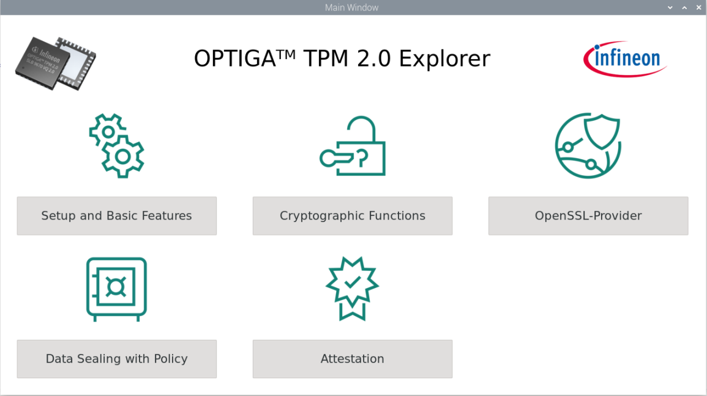 |
| --------------------------------------------- |

Figure 3: Setup and Basic Features Selection


### OPTIGA™ TPM Setup Functions

Setup function descriptions 

| 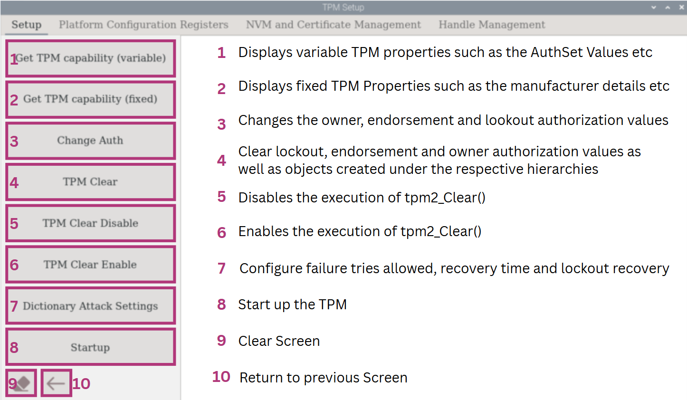 |
| --------------------------------------------------- |

Figure 4: OPTIGA™ TPM Setup Menu Function Descriptions


 ### <a name="tpm-startup"></a>TPM Startup

The OPTIGA™ TPM will startup when the RPI is powered on. However, if the reset button is pressed, the TPM2_startup command must be invoked separately by clicking on the "Startup" button before running any TPM command or operation. Otherwise, error message will be displayed for example if  "Get TPM Capability (variable)" button is selected as follow.  


```shell
ERROR:esys:src/tss2-esys/api/Esys_GetCapability.c:307:Esys_GetCapability_Finish() Received a non-TPM Error 
ERROR:esys:src/tss2-esys/api/Esys_GetCapability.c:107:Esys_GetCapability() Esys Finish ErrorCode (0x000a0008) 
ERROR: Esys_GetCapability(0xA0008) - tcti:Fails to connect to next lower layer
ERROR: Unable to run tpm2_getcap
'tpm2_getcap properties-variable' executed 
++++++++++++++++++++++++++++++++++++++++++++
```

Error Message: Display TPM capability (variable) failure due to reset without running TPM2_startup


To startup the OPTIGA™ TPM, select the "Startup" button in the left panel. Then, check if the TPM is functional by selecting "Get TPM Capability (variable)". TPM variable parameters can now be displayed.  

```shell
'tpm2_startup -c' executed 
++++++++++++++++++++++++++++++++++++++++++++
TPM2_PT_PERMANENT:
  ownerAuthSet:              0
  endorsementAuthSet:        0
  lockoutAuthSet:            0
  reserved1:                 0
  disableClear:              0
  inLockout:                 0
  tpmGeneratedEPS:           1
  reserved2:                 0
TPM2_PT_STARTUP_CLEAR:
  phEnable:                  1
  shEnable:                  1
  ehEnable:                  1
  phEnableNV:                1
  reserved1:                 0
  orderly:                   0
TPM2_PT_HR_NV_INDEX: 0x3
TPM2_PT_HR_LOADED: 0x0
TPM2_PT_HR_LOADED_AVAIL: 0x3
TPM2_PT_HR_ACTIVE: 0x0
TPM2_PT_HR_ACTIVE_AVAIL: 0x40
TPM2_PT_HR_TRANSIENT_AVAIL: 0x3
TPM2_PT_HR_PERSISTENT: 0x0
TPM2_PT_HR_PERSISTENT_AVAIL: 0x8
```

Expected Output (Partial): Display TPM capability (variable) successfully after TPM2_startup


### Viewing TPM (fixed) Capabilities

The TPM capabilities (fixed) can be displayed using tpm2_getcap properties-fixed in TPM2 tools. The fixed capabilities shows important information such as the TPM vendor and the firmware version. It also displays the manufacturer as well as many other information.

To view fixed capabilities and details, select "Get TPM Capability (fixed)" button. Information such as the manufacturer, firmware and more can be found here. 

```
TPM2_PT_FAMILY_INDICATOR:
  raw: 0x322E3000
  value: "2.0"
TPM2_PT_LEVEL:
  raw: 0
TPM2_PT_REVISION:
  raw: 0x9F
  value: 1.59
TPM2_PT_DAY_OF_YEAR:
  raw: 0xAA
TPM2_PT_YEAR:
  raw: 0x7E4
TPM2_PT_MANUFACTURER:
  raw: 0x49465800
  value: "IFX"
TPM2_PT_VENDOR_STRING_1:
  raw: 0x534C4239
  value: "SLB9"
TPM2_PT_VENDOR_STRING_2:
  raw: 0x36373200
  value: "672"
TPM2_PT_VENDOR_STRING_3:
  raw: 0x0
  value: ""
TPM2_PT_VENDOR_STRING_4:
  raw: 0x0
  value: ""
```

Expected Output (Partial): Setup Menu display Get TPM capability (fixed)


### Changing Authorization values of TPM

**WARNING:** Performing a TPM Clear will result in the reset of the TPM.

First, perform a "TPM Clear" by selecting the corresponding button in the left panel so that the TPM will be reconfigured to default mode. Then select "Get TPM capability (variable)" to display default TPM variable parameters. When the owner, endorsement and lockout authorization values are not changed, the variable value should be '0'.

```
TPM2_PT_PERMANENT:
  ownerAuthSet:              0
  endorsementAuthSet:        0
  lockoutAuthSet:            0
```

Expected Output (Partial): After resetting to default mode, the owner, endorsement, and lockout authorization values should all be zero.


To change the lockout, endorsement, and owner authorization values of TPM, select "Change Auth" in the left panel.  In the pop-up dialog, click "SET ALL" to confirm the credentials. We’ll use the following values as an example.

| 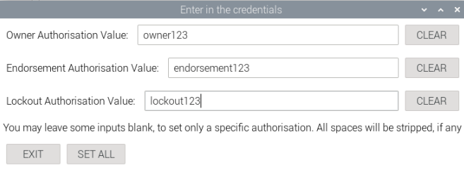 |
| :----------------------------------------------: |

Figure 5: Configure authorization values in the pop-up dialog

Once successful, select "Get TPM capability (variable)" to confirm the results. The first 3 AuthSet values should be 1 once the owner, endorsement and lockout authorization value values are set. 

```
TPM2_PT_PERMANENT:
  ownerAuthSet:              1
  endorsementAuthSet:        1
  lockoutAuthSet:            1
```

Expected Output (Partial): If the owner, endorsement, and lockout authorization values are all set, the corresponding AuthSet values should all be one.


### Dictionary Attack

Select "Dictionary Attack Settings" in the left panel to configure settings for dictionary attacks. In the pop-up dialog, configure the dictionary attack settings and select "OK" to confirm. You can change the number of attempts before lockout, the time taken for recovery from failure and lockout recovery.

| 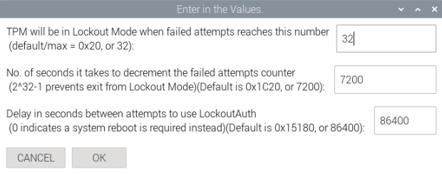 |
| ----------------------------------------------------------- |

Figure 6: Dictionary Attack Settings Configuration


If the Dictionary Attack Settings are successfully configured, the three following values will be changed accordingly when selecting "Get TPM capability (Variable)".

```
TPM2_PT_MAX_AUTH_FAIL: 0x20
TPM2_PT_LOCKOUT_INTERVAL: 0x1C20
TPM2_PT_LOCKOUT_RECOVERY: 0x15180
```

Expected Output (Partial): Dictionary Attack Settings Successfully Configured shown on TPM Capability (Variable)


### TPM ClearLock

The TPM ClearLock in TPM2 tools will effectively block/unblock lockout authorization handle for issuing TPM clear. This is to prevent TPM reset to default mode.

To disable 'tpm2_clear' command, select "TPM Clear Enable" in the left panel. Then, select "TPM Clear". It should fail.

```
'tpm2_clearcontrol -C l s -P 1' executed 
++++++++++++++++++++++++++++++++++++++++++++
WARNING:esys:src/tss2-esys/api/Esys_Clear.c:291:Esys_Clear_Finish() Received TPM Error 
ERROR:esys:src/tss2-esys/api/Esys_Clear.c:97:Esys_Clear() Esys Finish ErrorCode (0x00000120) 
ERROR: Esys_Clear(0x120) - tpm:error(2.0): the command is disabled
ERROR: Unable to run tpm2_clear
'tpm2_clear -c p' executed 
++++++++++++++++++++++++++++++++++++++++++++
```

Expected Output: TPM Clearlock successfully enabled

To re-enable "TPM Clear", select "TPM Clear Enable" in the left panel to disable clearlock. Then, perform a "TPM Clear" and check variable using "Get TPM capability (variable)" . AuthSet should be successfully cleared.

```
TPM2_PT_PERMANENT:
  ownerAuthSet:              1
  endorsementAuthSet:        1
  lockoutAuthSet:            1
```

Expected Output (Partial):  TPM Clearlock successfully disabled


## Platform Configuration Registers

This section shows you the functionalities of the PCR in the OPTIGA™ TPM.

From the "Setup and Basic Features" menu, select the "Platform Configuration Registers".


### Platform Configuration Registers Functions

Platform Configuration Register function descriptions

| 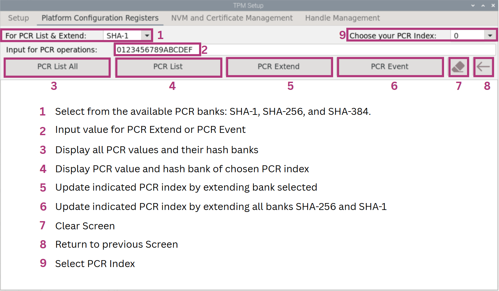 |
| --------------------------------------------- |

Figure 7: OPTIGA™ TPM Platform Configuration Registers Functions Descriptions


### PCR Listing


To list all 24 PCRs using SHA-1/SHA-256/SHA-384, select the corresponding bank name from the dropdown at the top (SHA-1 as the default setting). A pop-up dialog will then be shown. Press the "RESET" button on the TPM to apply the change and select "Reset Pressed" in the dialog. Once done,  click 'PCR List All'.

| 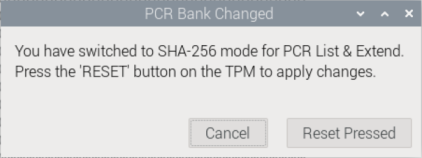 |
| --------------------------------------------- |

Figure 8: PCR List All 24 Registers in SHA-256


```
'tpm2_pcrallocate sha1:all+sha256:none' executed
'tpm2_startup --clear' executed
  sha256:
    0 : 0x0000000000000000000000000000000000000000000000000000000000000000
    1 : 0x0000000000000000000000000000000000000000000000000000000000000000
    2 : 0x0000000000000000000000000000000000000000000000000000000000000000
    3 : 0x0000000000000000000000000000000000000000000000000000000000000000
    ......
    17: 0xFFFFFFFFFFFFFFFFFFFFFFFFFFFFFFFFFFFFFFFFFFFFFFFFFFFFFFFFFFFFFFFF
    18: 0xFFFFFFFFFFFFFFFFFFFFFFFFFFFFFFFFFFFFFFFFFFFFFFFFFFFFFFFFFFFFFFFF
    19: 0xFFFFFFFFFFFFFFFFFFFFFFFFFFFFFFFFFFFFFFFFFFFFFFFFFFFFFFFFFFFFFFFF
    20: 0xFFFFFFFFFFFFFFFFFFFFFFFFFFFFFFFFFFFFFFFFFFFFFFFFFFFFFFFFFFFFFFFF
    ......
    23: 0x0000000000000000000000000000000000000000000000000000000000000000
'tpm2_pcrread shaxxx' executed 
++++++++++++++++++++++++++++++++++++++++++++
```

Expected Output: PCR List All 24 Registers in SHA-256 as an example


To view a specific register from the 24 available, first select a PCR index from the list at the top. Then, click the "PCR List" button to display the corresponding PCR value. You can also switch between SHA-1, SHA-256, and SHA-384 by using the dropdown menu at the top.


```
  sha1:
    1 : 0x0000000000000000000000000000000000000000
'tpm2_pcrread' executed 
++++++++++++++++++++++++++++++++++++++++++++
'tpm2_pcrallocate sha1:none+sha256:all' executed
'tpm2_startup --clear' executed
  sha256:
    1 : 0x0000000000000000000000000000000000000000000000000000000000000000
'tpm2_pcrread' executed 
++++++++++++++++++++++++++++++++++++++++++++
  sha256:
    20: 0xFFFFFFFFFFFFFFFFFFFFFFFFFFFFFFFFFFFFFFFFFFFFFFFFFFFFFFFFFFFFFFFF
'tpm2_pcrread' executed 
++++++++++++++++++++++++++++++++++++++++++++

```

Expected Output: Examples of PCR listing specific register in SHA-1 and SHA-256


### PCR Extend and PCR Event

To perform a PCR Extend, enter an input in the "Input for PCR operations" and select "PCR Extend". In this example, the default input of "0123456789ABCDEF" is used. Only the PCR bank selected will be extended. 

```
sha256:
    0 : 0x0000000000000000000000000000000000000000000000000000000000000000
'tpm2_pcrread' executed 
++++++++++++++++++++++++++++++++++++++++++++
Input= 123456789abcdef0000000000000000000000000000000000000000000000000
'tpm2_pcrextend' executed 
++++++++++++++++++++++++++++++++++++++++++++
  sha256:
    0 : 0x464D25FC35AC43941106533AC8C27A2E3AA4A4DE26D70A15A1BF85193BBA9349
'tpm2_pcrread' executed 
++++++++++++++++++++++++++++++++++++++++++++
```

Expected Output: PCR Extend function in SHA256


To perform a PCR Event, enter a value in the "Input for PCR operations" field and select the "PCR Event" option. In this example, the default input "0123456789ABCDEF" is used. All PCR banks—SHA-1, SHA-256, and SHA-384—will be extended accordingly, as shown below.

```
sha1: ce27cb141098feb00714e758646be3e99c185b71
sha256: 2125b2c332b1113aae9bfc5e9f7e3b4c91d828cb942c2df1eeb02502eccae9e9
sha384: 4d9f86403277358dbfd9250a5e7538a545b57404e69594238ab6d95a727788aac005cdf3e88ee26d5d2fa68e72e6d497
'tpm2_pcrevent' executed 
++++++++++++++++++++++++++++++++++++++++++++
```

Expected Output: PCR Event function


## NVM and Certificate Management

This section shows you the functionalities of the NVM and Certificate Management in the OPTIGA™ TPM.

From the "Setup and Basic Features" menu, select the "NVM and Certificate Management".


### NVM and Certificate Management Functions

NVM and Certificate Management function descriptions

| 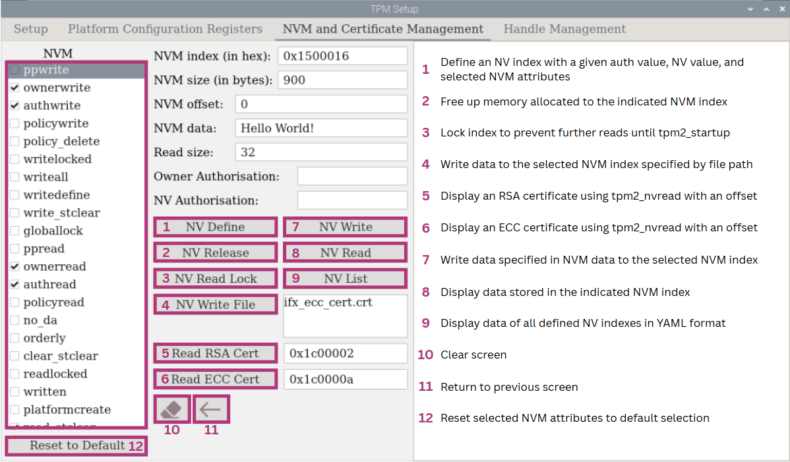 |
| ---------------------------------------------- |

Figure 9: OPTIGA™ TPM NVM and Certificate Management Functions Descriptions

 

### NV Define

Select the necessary NVM attributes, then enter the NVM index and size. By default, the owner authorization field is empty. If it was configured earlier in the "Setup" section, the corresponding value will automatically appear in the input field. For NV authorization, you may either leave the field blank or enter a value to set it manually. Click "NV Define", then "NV List" to verify that NVM index 0x1500016 has been successfully defined. This example uses the default attribute settings.

After selecting "NV List", all defined NVM indexes will be shown. NVM index 0x1500016 has been defined as shown below. In the box, Index 0x1c00002, 0x1c0000a and 0x1c00016 are Infineon EK certificates respectively and **should not** be edited.  

```
Attributes are: ownerwrite|authwrite|ownerread|authread|read_stclear
nv-index: 0x1500016
'tpm2_nvdefine' executed 
++++++++++++++++++++++++++++++++++++++++++++
0x1500016:
  name: 000b3582222e04749fb48f14a4f563f6d948c61318941f16d16383191b33e95fb261
  hash algorithm:
    friendly: sha256
    value: 0xB
  attributes:
    friendly: ownerwrite|authwrite|ownerread|authread|read_stclear
    value: 0x80060006
  size: 900

0x1c00002:
  name: 000bd91c8df868461c4d4fa966578da6d1fc64b486753d1d9dfb59bf3ee6387224bf
  hash algorithm:
    friendly: sha256
    value: 0xB
  attributes:
    friendly: ppwrite|writedefine|ppread|ownerread|authread|no_da|written|platformcreate
    value: 0x62072001
  size: 1429

0x1c0000a:
  name: 000bbf3b11b0e5ff0784f3a3741e5a593b5db538f7e9fde75551692fab30840323b6
  hash algorithm:
    friendly: sha256
    value: 0xB
  attributes:
    friendly: ppwrite|writedefine|ppread|ownerread|authread|no_da|written|platformcreate
    value: 0x62072001
  size: 846

0x1c00016:
  name: 000b046b18cf41cf4661193a87480ab93ca379ca625b303170858a302b4573727204
  hash algorithm:
    friendly: sha256
    value: 0xB
  attributes:
    friendly: ppwrite|writedefine|ppread|ownerread|authread|no_da|written|platformcreate
    value: 0x62072001
  size: 874

'tpm2_nvreadpublic' executed 
```

Expected Output: NV List Display


### NV Write

To write in the NV, enter what you wish to input in the NV in the "NVM data". Then select "NV Write" to write and "NV Read" to see what you have written.

```
'tpm2_nvwrite' executed 
++++++++++++++++++++++++++++++++++++++++++++
00000000: 4865 6c6c 6f20 576f 726c 6421 0000 0000  Hello World!....
00000010: 0000 0000 0000 0000 0000 0000 0000 0000  ................

'tpm2_nvread' executed 
++++++++++++++++++++++++++++++++++++++++++++
```

Expected Output: NV Write and NV Read display


### Reading Certificate

The "ifx_ecc_cert.crt" and the "ifx_rsa_cert.crt" will be created during "Read RSA Cert" and "Read ECC Cert" process. These are the EK Certificates that are inside handles 0x1c00002 and 0x1c0000a respectively.

To read RSA Cert in the NV, ensure that the RSA Cert index is correct and select "Read RSA Cert". In this example, we read the Infineon EK certificate "0x1c00002". A "ifx_rsa_cert.crt" will be created during "Read RSA Cert" process.


```
Certificate:
    Data:
        Version: 3 (0x2)
        Serial Number: 190513399 (0xb5b00f7)
        Signature Algorithm: sha384WithRSAEncryption
        Issuer: C = DE, O = Infineon Technologies AG, OU = OPTIGA(TM), CN = Infineon OPTIGA(TM) TPM 2.0 RSA CA 056
        Validity
            Not Before: Jul  4 16:41:34 2021 GMT
            Not After : Jul  4 16:41:34 2036 GMT
        Subject: 
        Subject Public Key Info:
            Public Key Algorithm: rsaEncryption
                Public-Key: (2048 bit)
                Modulus:
                    00:ca:2f:cf:35:a8:95:e2:ff:5c:a4:10:b5:10:ec:
                    ae:96:5d:6e:e8:be:f4:8f:f1:28:e6:fc:82:68:3f:
                    ......

```


Expected Output: Example of reading RSA Cert


To read ECC Cert in the NV, ensure that the ECC Cert index is correct and select "Read ECC Cert". In this example, we read the Infineon EK certificate "0x1c0000a". A "ifx_ecc_cert.crt" will be created during "Read ECC Cert" process.


```
Certificate:
    Data:
        Version: 3 (0x2)
        Serial Number: 708618584 (0x2a3ca958)
        Signature Algorithm: ecdsa-with-SHA512
        Issuer: C = DE, O = Infineon Technologies AG, OU = OPTIGA(TM), CN = Infineon OPTIGA(TM) TPM 2.0 ECC CA 056
        Validity
            Not Before: Jul  4 16:40:24 2021 GMT
            Not After : Jul  4 16:40:24 2036 GMT
        Subject: 
        Subject Public Key Info:
            Public Key Algorithm: id-ecPublicKey
                Public-Key: (256 bit)
                pub:
                    04:b9:56:51:85:c8:34:f5:86:6b:46:cd:ad:53:3b:
                    3f:84:40:9e:0a:5c:f1:57:44:7f:a1:9e:c4:f0:ad:
                    4b:bb:40:a7:21:e6:8b:cc:33:31:57:aa:4c:56:5e:
					......
```


Expected Output: Example of reading ECC Cert


### Writing File

To write a file, click the file name field, which defaults to "ifx_ecc_cert.crt". After selecting the desired file, the file path will be automatically updated. In this example, a local ifx_ecc_cert.crt file is selected and NVM index 0x1500016 is used. Click "NV Write File" to write the selected file to this index.

To verify the operation, input appropriate read size and click "NV Read" to read the file you have just written.

```
'tpm2_nvwrite' executed 
++++++++++++++++++++++++++++++++++++++++++++
00000000: 3082 034a 3082 02ab a003 0201 0202 042a  0..J0..........*
00000010: 3ca9 5830 0a06 082a 8648 ce3d 0403 0430  <.X0...*.H.=...0
00000020: 7631 0b30 0906 0355 0406 1302 4445 3121  v1.0...U....DE1!
00000030: 301f 0603 5504 0a0c 1849 6e66 696e 656f  0...U....Infineo
00000040: 6e20 5465 6368 6e6f 6c6f 6769 6573 2041  n Technologies A
00000050: 4731 1330 1106 0355 040b 0c0a 4f50 5449  G1.0...U....OPTI
00000060: 4741 2854 4d29 312f 302d 0603 5504 030c  GA(TM)1/0-..U...
00000070: 2649 6e66 696e 656f 6e20 4f50 5449 4741  &Infineon OPTIGA
00000080: 2854 4d29 2054 504d 2032 2e30 2045 4343  (TM) TPM 2.0 ECC
00000090: 2043 4120 3035 3630 1e17 0d32 3130 3730   CA 0560...21070
......

'tpm2_nvread' executed 
++++++++++++++++++++++++++++++++++++++++++++
```


Expected Output (Partial): Reading NV Written file

As an ECC cert was written, we can also use "Read ECC Cert" by entering the corresponding NVM index (0x1500016 in this example) to show the certificate in the proper format.  


```
Certificate:
    Data:
        Version: 3 (0x2)
        Serial Number: 708618584 (0x2a3ca958)
        Signature Algorithm: ecdsa-with-SHA512
        Issuer: C = DE, O = Infineon Technologies AG, OU = OPTIGA(TM), CN = Infineon OPTIGA(TM) TPM 2.0 ECC CA 056
        Validity
            Not Before: Jul  4 16:40:24 2021 GMT
            Not After : Jul  4 16:40:24 2036 GMT
        Subject: 
        Subject Public Key Info:
            Public Key Algorithm: id-ecPublicKey
                Public-Key: (256 bit)
                pub:
                    04:b9:56:51:85:c8:34:f5:86:6b:46:cd:ad:53:3b:
                    3f:84:40:9e:0a:5c:f1:57:44:7f:a1:9e:c4:f0:ad:
                    4b:bb:40:a7:21:e6:8b:cc:33:31:57:aa:4c:56:5e:
					......
```
Figure 38: Reading NV written file using Read ECC Cert


### NV Release

To delete an NV index, select "NV Release". Select "NV List" to ensure that it is a success. 0x1500016 should be released.


```
++++++++++++++++++++++++++++++++++++++++++++
'tpm2_nvrelease' executed 
++++++++++++++++++++++++++++++++++++++++++++
0x1c00002:
  name: 000bd91c8df868461c4d4fa966578da6d1fc64b486753d1d9dfb59bf3ee6387224bf
  ......

0x1c0000a:
  name: 000bbf3b11b0e5ff0784f3a3741e5a593b5db538f7e9fde75551692fab30840323b6
  ......
  
0x1c00016:
  name: 000b046b18cf41cf4661193a87480ab93ca379ca625b303170858a302b4573727204
  ......

'tpm2_nvreadpublic' executed 
++++++++++++++++++++++++++++++++++++++++++++
```


Expected Output (Partial): NV Release and NV List default


## Handle Management

This section shows you the functionalities of Handle Management in the OPTIGA™ TPM. The handle management is used to manage all persistent and transient keys in the OPTIGA™ TPM. It is necessary as there is a limit of 3 transient and 7 persistent keys. Hence, handle management can evict persistent keys or flush transient keys to make for more transient and persistent keys.

###  Handle Management Functions

Handle Management function descriptions.

| 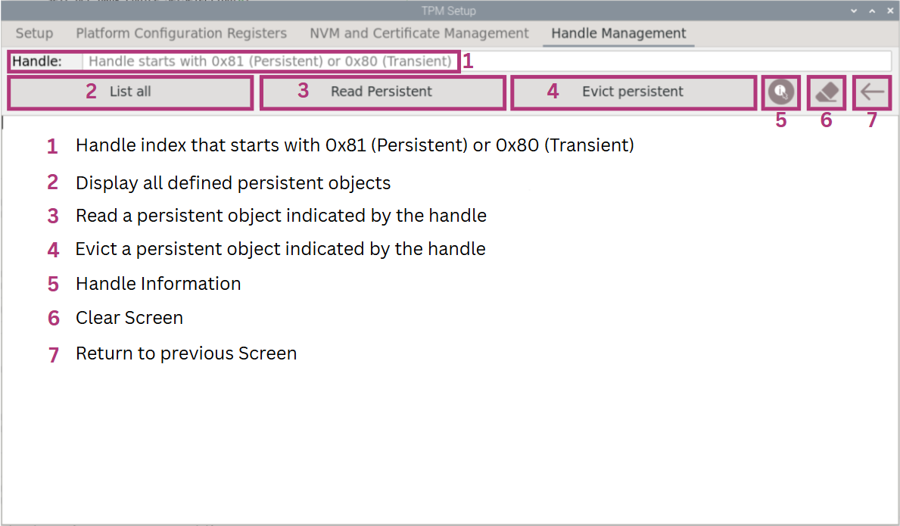 |
| --------------------------------------------------------------- |

Figure 10: OPTIGA™ TPM Handle Management Functions Descriptions


### Handle Management List All


Select "List All" to list all persistent handles. All persistent handles will be listed. You should have no persistent handles shown. Refer to **3.3.2** in order to create a persistent handle. Section 3.3.2 creates a Primary Key which in its process makes the handle 0x81000006 persisted. Once done, it will be listed when selecting the handle management "List all" button.


```
- 0x81000006
'tpm2_getcap handles-persistent' executed 
++++++++++++++++++++++++++++++++++++++++++++

```

Input a persisted handle (0x81000006 as an example here) and select "Read Persistent" to see the information of the persistent handle selected.  The information of the persistent handle will shown on the display.

```
name: 000bba84e5c944b7fc4d96a7edee44924afd0857e0ce1b1811bc552102fb89b0e983
qualified name: 000be59e818092815f8cc6d4ad9e8c13b0d23c195a1a3235e7629c15380063817dd7
name-alg:
  value: sha256
  raw: 0xb
attributes:
  value: fixedtpm|fixedparent|sensitivedataorigin|userwithauth|restricted|decrypt
  raw: 0x30072
type:
  value: ecc
  raw: 0x23
......
  value: cfb
  raw: 0x43
sym-keybits: 128
x: 323e75f8b0fa4d7576329c6a0c1f656b8ec478c80af3badc544e1ff662ef47f9
y: f9f9f5eea71c1bd5380489d19c807e32d677f1db32e35245159d137b2a0c2b11
'tpm2_readpublic -c 0x81000006' executed 
++++++++++++++++++++++++++++++++++++++++++++
```


Expected Output (Partial): Handle Management Read Persistent Display


### Handle Management Evict Persistent

Once a persistent handle is created under section 3.3.2 (0x81000006 as an example here), the persistent handle 0x81000006 can be evicted to make space for more persistent handles.

To evict persistent, input the correct handle value and select "Evict persistent". Once executed, the persistent handle "0x81000006" should be evicted as shown below.


```
persistent-handle: 0x81000006
action: evicted
'tpm2_evictcontrol -C o -c 0x81000006 -P ' executed 
++++++++++++++++++++++++++++++++++++++++++++
'tpm2_getcap handles-persistent' executed 
++++++++++++++++++++++++++++++++++++++++++++
```


Expected Output: Handle Management Evict Persistent List All Screen


# Cryptographic Functions

This section shows you the Cryptographic Functions of the OPTIGA™ TPM. It can be used to hash, encrypt/decrypt or sign and verify using OpenSSL or the TPM2 tools.

Go back to the main screen and select "Cryptographic Functions".

|  |
| -------------------------------------------- |

Figure 50: OPTIGA TPM 2.0 Explorer Cryptographic Functions Seletcion

|  |
| ------------------------------------------------- |

Figure 51: Cryptographic Functions Main Screen


## Hash Cryptographic Functions

The hash function in this user interface only supports SHA-256. To hash with another algorithm, you can use "tpm2_hash" command in the terminal.

Select "Hash" in the Cryptographic Functions.

|  |
| ------------------------------------------- |

Figure 52: Cryptographic Hash Selection

To hash an input, enter an input and select "Hash (SHA-2).

|  |
| ---------------------------------------------------- |

Figure 53: Cryptographic Hash Display


## RSA Cryptographic Functions

Select "RSA".

|  |
| ----------------------------------------------------- |

Figure 54: Cryptogtaphic Functions RSA Selection

|  |
| ------------------------------------------------------- |

Figure 55: Cryptogtaphic Functions RSA Menu


### RSA Cryptographic Function Description

RSA Cryptographic Function Description

| 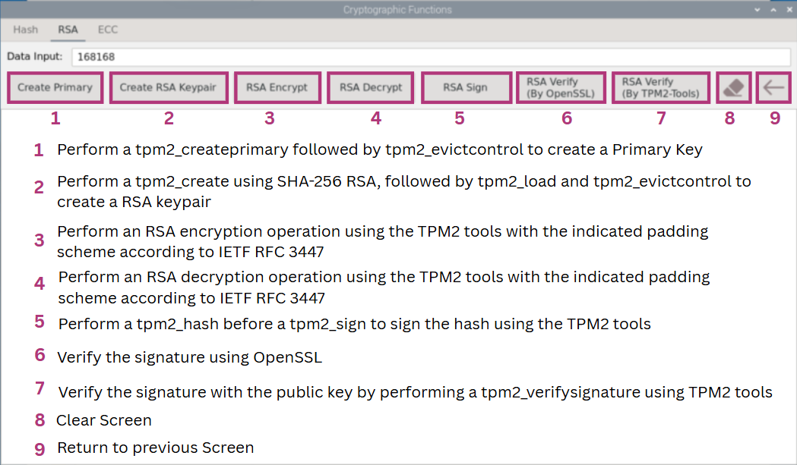 |
| --------------------------------------------------- |

Figure 56: RSA Cryptographic Function Description


### Creating RSA Keypair

To create RSA keypair, create a primary key first by selecting "Create Primary".

|  |
| ------------------------------------------- |

Figure 57: RSA Create Primary Selection

Enter the set value of the Owner Authorization Value and select "OK" to create primary key.

|  |
| ----------------------------------------------------------- |

Figure 58: Owner Authorization confirmation for creating primary key

The command tpm2_createprimary will be performed followed by a tpm2_evictcontrol to make it persistent using TPM2 tools as seen in Figure 59. The primary key is created with a parameter 'o' under the storage hierarchy.

|  |
| ------------------------------------------------------------ |

Figure 59: Cryptogtaphic Functions RSA Create Primary Succeeded

Next, create RSA keypair by selecting "Create RSA Keypair".

|  |
| ----------------------------------------- |

Figure 60: Create RSA Keypair Selection

Enter the set value of the Owner Authorization Value and select "OK" to create RSA Keypair.

|  |
| ---------------------------------- |

Figure 61: Owner Authorization confirmation for creating RSA Keypair

RSA Keypair successfully created. The command tpm2_create was used to create a RSA key pair under the storage hierarchy. The created key pair was then loaded to the TPM with tpm2_load. Finally, the RSA key was made to be persistent with tpm2_evictcontrol.

|  |
| ----------------------------------------------------------- |

Figure 62: Create RSA Keypair succeeded


### Encrypting and Decrypting RSA

To encrypt an input using RSA key, enter your input and select "RSA Encrypt".

|  |
| ----------------------------------------------------- |

Figure 63: RSA Encrypt

The data has been encrypted.

| 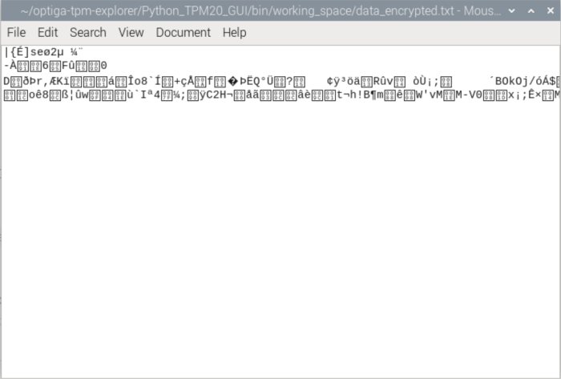 |
| ------------------------------------------------------------ |

Figure 64: Encrypted “data_encrypted.txt” shown in unreadable form

To decrypt encrypted data using RSA key, simply select "RSA Decrypt".

|  |
| --------------------------------------- |

Figure 65: RSA Decrypt

Data has been decrypted.

|  |
| ----------------------------------------------------- |

Figure 66: RSA Decrypt succeeded


### Signing and Verifying RSA

To perform RSA Sign, select "RSA Sign".

|  |
| -------------------------------------------------- |

Figure 67: RSA Sign

To verify signature using **OpenSSL**, select "RSA Verify (By OpenSSL)". A success message "Verified OK" should be displayed if "Data Input" is correct.

|  |
| ------------------------------------------------------------ |

Figure 68: RSA signature check with OpenSSL succeeded

If "Data Input" is wrong, an error message "Verification Failure" will be displayed.

|  |
| ------------------------------------------------------------ |

Figure 69: RSA signature check with OpenSSL failed

To verify signature using TPM2 tools, select "RSA Verify (By TPM)" to perform a 'tpm2_verifysignature'. No error messages should be displayed if "Data Input" is correct.

|  |
| ------------------------------------------------------------ |

Figure 70: RSA signature check with TPM2 tools succeeded

If "Data Input" is wrong, error messages will be displayed to indicate failure.

|  |
| ------------------------------------------------------------ |

Figure 71: RSA signature check with TPM2 tools failed


## ECC Cryptographic Functions

Select "ECC".

|  |
| ------------------------------------- |

Figure 72: Cryptographic Functions ECC Selection

|  |
| ------------------------------------------------------------ |

Figure 73: Cryptographic Functions ECC Main Screen


### ECC Cryptographic Function Description

ECC Cryptographic Function Description

| 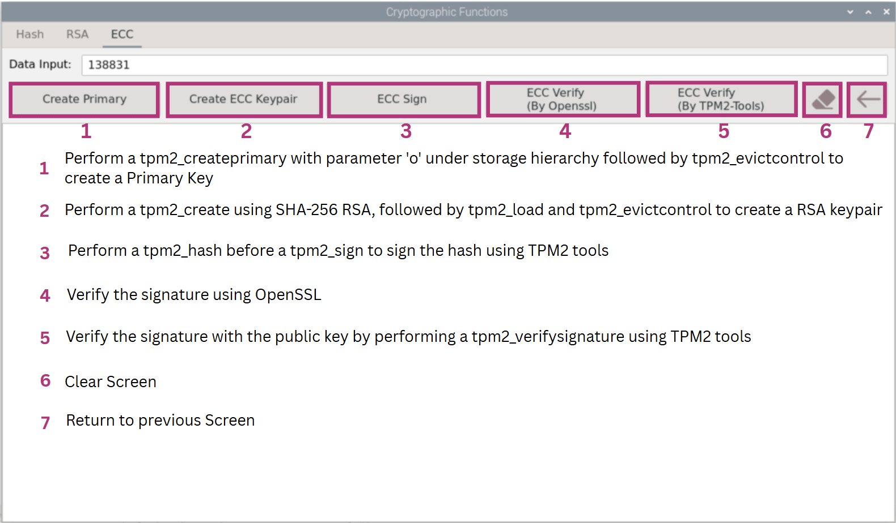 |
| -------------------------------------------------------- |

Figure 74: ECC Cryptographic Function Description


### Creating ECC Keypair

To create a ECC keypair, create a primary key first by selecting "Create Primary" to create primary key for ECC.

|  |
| --------------------------------------------------------- |

Figure 75: ECC Create Primary

Enter the set value of the Owner Authorization Value and select "OK" to create primary key.

|  |
| ---------------------------------------- |

Figure 76: Owner Authorization confirmation for creating primary key

The command tpm2_createprimary will be performed followed by a tpm2_evictcontrol to make it persistent using TPM2 tools as seen in Figure 77. The primary key is created with a parameter 'o' under the storage hierarchy.

|  |
| ----------------------------------------------------------- |

Figure 77: ECC Create Primary Display

Next, create ECC keypair by selecting "Create ECC Keypair".

|  |
| ------------------------------------------------------------ |

Figure 78: Create ECC Keypair Selection

Enter the set value of the Owner Authorization Value and select "OK" to create ECC Keypair.

|  |
| ----------------------------------------------- |

Figure 79: Owner Authorization confirmation for creating ECC Keypair

ECC Keypair successfully created. The command tpm2_create was used to create a ECC key pair under the storage hierarchy. The created key pair was then loaded to the TPM with tpm2_load. Finally, the ECC key was made to be persistent with tpm2_evictcontrol.

|  |
| ------------------------------------------------------------ |

Figure 80: Create ECC Keypair succeeded


### Signing and Verifying ECC

To perform ECC Sign, select "ECC Sign".

|  |
| -------------------------------------------------- |

Figure 81: ECC Sign

To verify signature using **OpenSSL**, select "ECC Verify (By OpenSSL)". A success message "Verified OK" should be displayed if "Data Input" is correct.

|  |
| ------------------------------------------------------------ |

Figure 82: ECC signature check with OpenSSL succeeded

If "Data Input" is wrong, an error message "Verification Failure" will be displayed.

|  |
| ------------------------------------------------------------ |

Figure 83: ECC signature check with OpenSSL failed

To verify signature using TPM2 tools, select "ECC Verify (By TPM)" to perform a 'tpm2_verifysignature'. No error messages should be displayed if "Data Input" is correct.

|  |
| ------------------------------------------------------------ |

Figure 84: ECC signature check with TPM2 tools succeeded

If "Data Input" is wrong, error messages will be displayed to indicate failure.

|  |
| ----------------------------------------------------------- |

Figure 85: ECC signature check with TPM failed


# OpenSSL Engine

OpenSSL is an open-source tool that is commonly used for the Transport Layer Security (TLS) protocol. TLS is used by web services and IoT devices to transmit sensitive information between client/Endpoint and Server/Cloud applications.

This section shows you the OpenSSL-Engine functions of the OPTIGA™ TPM. The OpenSSL-Engine can be used to create an RSA/ECC(Client/Server) or do encryption/decryption or signing and verification. It can also be used to to random number generation.

Go back to the main screen and select "OpenSSL-Engine".

|  |
| ------------------------------------ |

Figure 86: OPTIGA TPM 2.0 Explorer OpenSSL-Engine Selection

|  |
| ------------------------------------------------------------ |

Figure 87: OpenSSL-Engine Main Screen


## RSA (Enc/Dec/Sign/Verify)

This section shows the uses of OpenSSL libraries to do encryption, decryption, signing and verification.

Select "RSA (Enc/Dec/Sign/Verify)".

|  |
| ------------------------------------------------------------ |

Figure 88: OpenSSL-Engine RSA (Enc/Dec/Sign/Verify) Selection

|  |
| ------------------------------------------------------------ |

Figure 89: OpenSSL-Engine RSA (Enc/Dec/Sign/Verify) Screen


### RSA (Enc/Dec/Sign/Verify) Function Description

RSA (Enc/Dec/Sign/Verify) Function Description

|  |
| --------------------------------------------------- |

Figure 90: RSA (Enc/Dec/Sign/Verify) Function Description


#### RSA Encryption and Decryption

To perform RSA functions, select "Generate RSA Keypair". RSA key is generated under storage hierarchy.

|  |
| ------------------------------------------------------------ |

Figure 91: OpenSSL-Engine RSA (Enc/Dec/Sign/Verify) Generate RSA Keypair

To encrypt an input, enter an input into "Data Input" and select "RSA Encrypt".

|  |
| ------------------------------------------------------------ |

Figure 92: OpenSSL-Engine RSA (Enc/Dec/Sign/Verify) Encrypt

To decrypt, select "RSA Decrypt". Data should be successfully decrypted.

|  |
| ------------------------------------------------------------ |

Figure 93: OpenSSL-Engine RSA (Enc/Dec/Sign/Verify) Decrypt


#### RSA Signing and Verification

To sign, enter input in "Data Input" and select "RSA Signing" to sign.

|  |
| ------------------------------------------------------------ |

Figure 94: OpenSSL-Engine RSA (Enc/Dec/Sign/Verify) Signing

To verify, ensure correct "Data Input" and select "RSA Verification".

|  |
| ------------------------------------------------------------ |

Figure 95: OpenSSL-Engine RSA (Enc/Dec/Sign/Verify) Verify Success

If "Data Input" is wrong, an error message "Verification Failure" will be displayed.

|  |
| ------------------------------------------------------------ |

Figure 96: OpenSSL-Engine RSA (Enc/Dec/Sign/Verify) Verification Failure


## Random Number Generator

This section shows the use of OpenSSL libraries in generating a random hex or base64 value with indicated no of bytes.

Select "RNG".

|  |
| --------------------------------------------------- |

Figure 97: OpenSSL-Engine RNG Selection

| 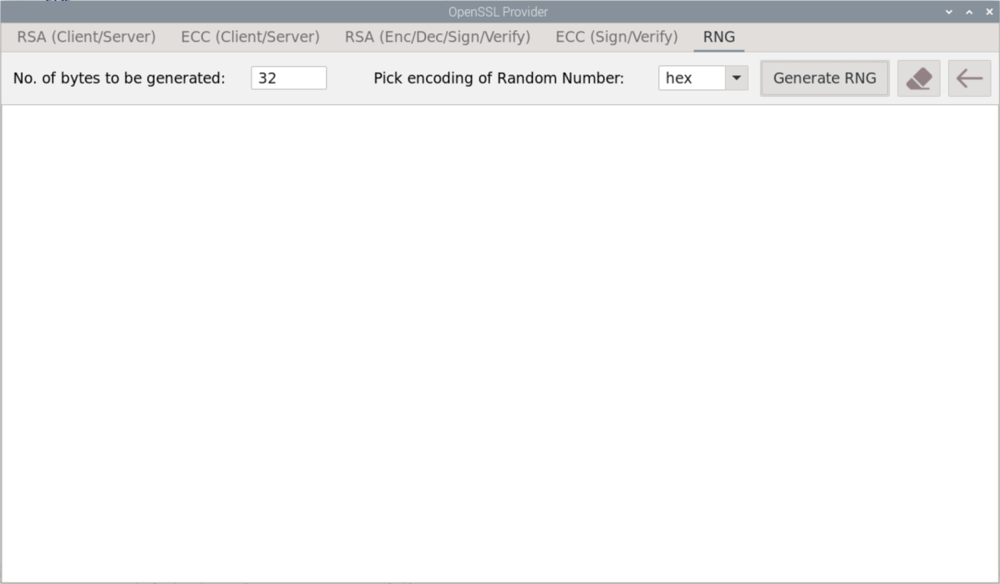 |
| ------------------------------------------------------------ |

Figure 98: OpenSSL-Engine RNG Screen

To change the bytes generated, enter the input in "No. of bytes to be generated". To change the encoding of the random number, select the arrow at "Pick encoding of Random Number" and select/<hex> or/<base64>. Select "Generate RNG" to generate random number.

|  |
| ------------------------------------------------ |

Figure 99: OpenSSL-Engine RNG Selection

In Figure 100, the numbers generated are 32 bytes in hex encoding and 64 bytes in base64 encoding.

|  |
| ------------------------------------------------- |

Figure 100: OpenSSL-Engine RNG Selection


## RSA (Client/Server) 

The RSA(Client/Server) is a demonstration of the hardening of the TLS session between a Client/Endpoint and Server/Cloud the OpenSSL S_Server and S_Client modules will be used along with the local host capability of Linux running on Raspberry Pi® 3B+/4.

TLS provides authenticated key exchange using asymmetric cryptography, data confidentiality using symmetric encryption and message integrity using message authentication codes scheme. However, these crypto primitives are stored in system memory and do not provide any trustworthiness assurance of the involved endpoint.

The drawback is that their implementation is using software library modules that store private keys in

application or secure memory and have proven to contain bugs or vulnerabilities which have been exploited for

the last several years.

The benefit of using SLx 9670/72 TPM2.0 to protect the private key involved in the TLS handshake process.

### RSA (Client/Server) Function Description

RSA (Client/Server) Function

| 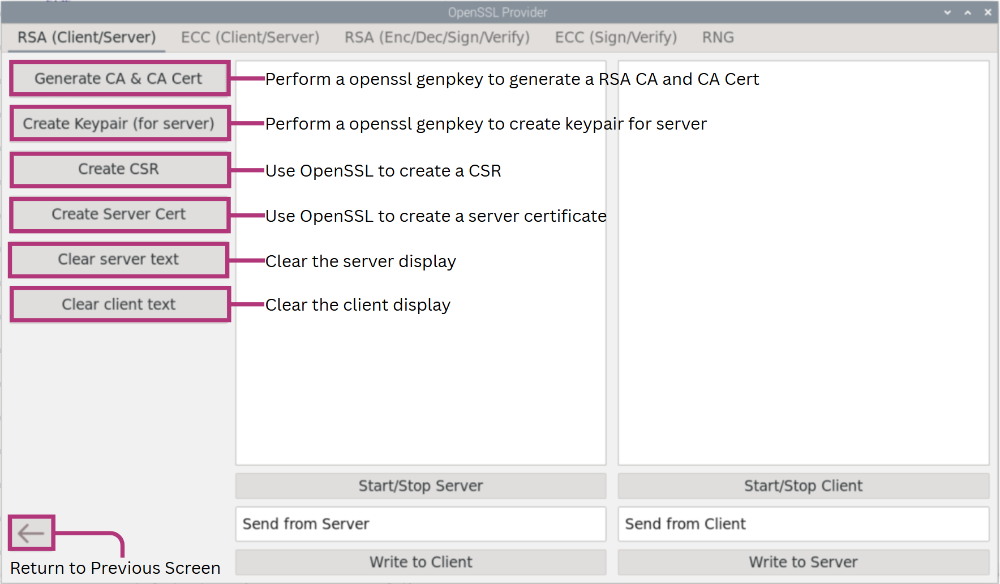 |
| --------------------------------------------- |

Figure 101: RSA (Client/Server) Function Description


### Create Root CA and Its Certificate

At the core of the PKI there is the Root CA where the chain of trust originates. In normal practice you would use an established CA like for example GlobalSign.

For the purpose of this evaluation software we used OpenSSL to create a Root Certificate Authority. This is not advised for production purposes.

**NOTE:** For the OpenSSL Engine, the Owner Authorization Value set should be set as owner123 in order to Generate CA & CA Cert. To set the Owner Authorization Value, refer to section 2.1.4 Changing Authorization values of TPM.

|  |
| -------------------------------------------- |

Figure 102: OpenSSL-Engine RSA (Client/Server) Generate CA &amp; CA Cert


### Create Server Certificate

Generate Keypair for server by selecting "Create Keypair (for server)".

|  |
| -------------------------------------------- |

Figure 103: OpenSSL-Engine RSA (Client/Server) Create Keypair (for server)

Generate Certificate Signing Request for the Certificate Authority using server private key by selecting "Create CSR".

|  |
| -------------------------------------------- |

Figure 104: OpenSSL-Engine RSA (Client/Server) Create CSR

Generate Server Certificate from CSR and CA private key by selecting "Create Server Cert".

|  |
| -------------------------------------------- |

Figure 105: OpenSSL-Engine RSA (Client/Server) Create Server Cert


### Create an OpenSSL Server

We will now create an OpenSSL server. For this purpose, we are using the local host capabilities to run this example on the same Linux machine.

Create an openssl server instance using a terminal window session by selecting "Start/Stop Server".

|  |
| ------------------------------------------------------------ |

Figure 106: OpenSSL-Engine RSA (Client/Server) Start Server


### Create an OpenSSL Client

We will create an OpenSSL Client and connect through a TLS session with OpenSSL Server (The two terminal windows and services running on the same Linux machine).

The OpenSSL Client will be run and the output of the connection is divided in two parts

a/) The TLS handshake

b/) TLS Cipher

As shown in Figure 107 the complete TLS handshake process was successful, and the encrypted channel established.

| 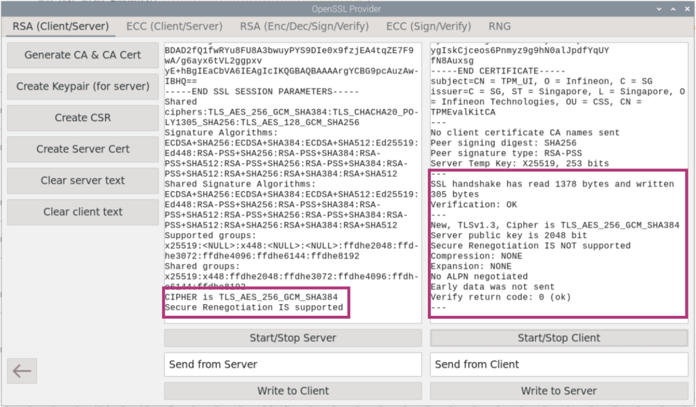 |
| ------------------------------------------------------------ |

Figure 107: OpenSSL-Engine RSA (Client/Server) Start Client


### Secure data exchange between Server and Client

Messages can be sent from Server to Client as well as Client to Server by entering input in the boxes below and selecting "Write to Server" or "Write to Client". The message "Message Hello World Sent from Client" and "Message Hello World Sent from Server" has been successfully sent in Figure 108.

| 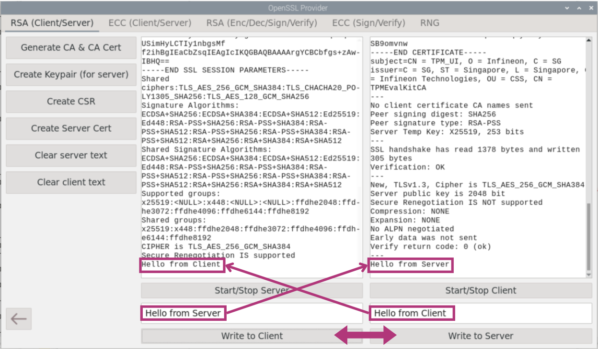 |
| ------------------------------------------------------------ |

Figure 108: OpenSSL-Engine RSA (Client/Server) Communication

To stop connection, end the server by selecting "Start/Stop Server".

|  |
| ------------------------------------------------------------ |

Figure 109: OpenSSL-Engine RSA (Client/Server) End Communication


## ECC (Client/Server)

The ECC(Client/Server) is a demonstration to show the use of the TPM Key for secure communications.

Select "ECC (Client/Server)".

|  |
| --------------------------------------------------- |

Figure 110: OpenSSL-Engine ECC (Client/Server) Selection


### ECC (Client/Server) Function Description

ECC (Client/Server) Function Description

| 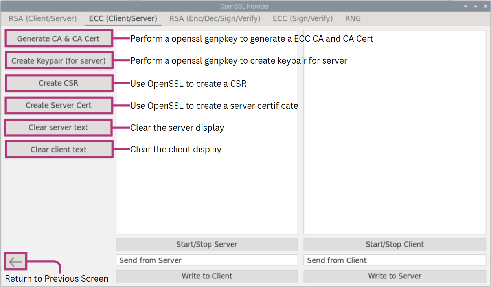 |
| --------------------------------------------- |

Figure 111: ECC (Client/Server) Function Description


### Create Root CA and Its Certificate

At the core of the PKI there is the Root CA where the chain of trust originates. In normal practice you would use an established CA like for example GlobalSign.

For the purpose of this evaluation software we used OpenSSL to create a Root Certificate Authority. This is not advised for production purposes.

**NOTE:** For the OpenSSL Engine, the Owner Authorization Value set should be set as owner123 in order to Generate CA & CA Cert. To set the Owner Authorization Value, refer to section 2.1.4 Changing Authorization values of TPM.

|  |
| -------------------------------------------- |

Figure 112: OpenSSL-Engine ECC (Client/Server) Generate CA &amp; CA Cert


### Create Server Certificate

Generate Keypair for server by selecting "Create Keypair (for server)".

|  |
| -------------------------------------------- |

Figure 113: OpenSSL-Engine ECC (Client/Server) Create Keypair (for server)

Generate Certificate Signing Request for CA using server private key by selecting "Create CSR".

|  |
| -------------------------------------------- |

Figure 114: OpenSSL-Engine ECC (Client/Server) Create CSR

Generate Server Certificate from CSR and CA private key by selecting "Create Server Cert".

|  |
| -------------------------------------------- |

Figure 115: OpenSSL-Engine ECC (Client/Server) Create Server Cert


### Create an OpenSSL Server

We will now create an OpenSSL server. For this purpose, we are using the local host capabilities to run this example on the same Linux machine.

Create an openssl S_Server instance using a terminal window session by selecting "Start/Stop Server".

|  |
| ------------------------------------------------------- |

Figure 116: OpenSSL-Engine ECC (Client/Server) Start Server


### Creating an OpenSSL Client

We will create an OpenSSL Client and connect through a TLS session with OpenSSL Server (The two terminal windows and services running on the same Linux machine).

The OpenSSL Client will be run and the output of the connection is divided in two parts

a/) The TLS handshake

b/) TLS Cipher

As shown in Figure 117 the complete TLS handshake process was successful, and the encrypted channel

| 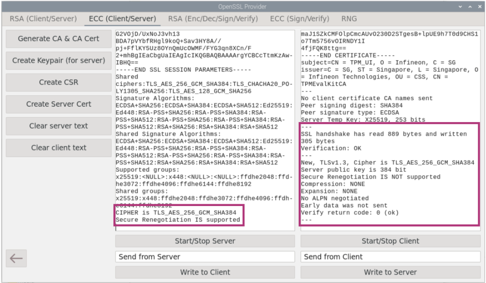 |
| ------------------------------------------------------- |

Figure 117: OpenSSL-Engine ECC (Client/Server) Start Client


### Secure data exchange between Server and client

Messages can be sent from Server to Client as well as Client to Server by entering input in the boxes below and selecting "Write to Server" or "Write to Client". The message "Message Hello World Sent from Client" and "Message Hello World Sent from Server" has been successfully sent in Figure 118.

| 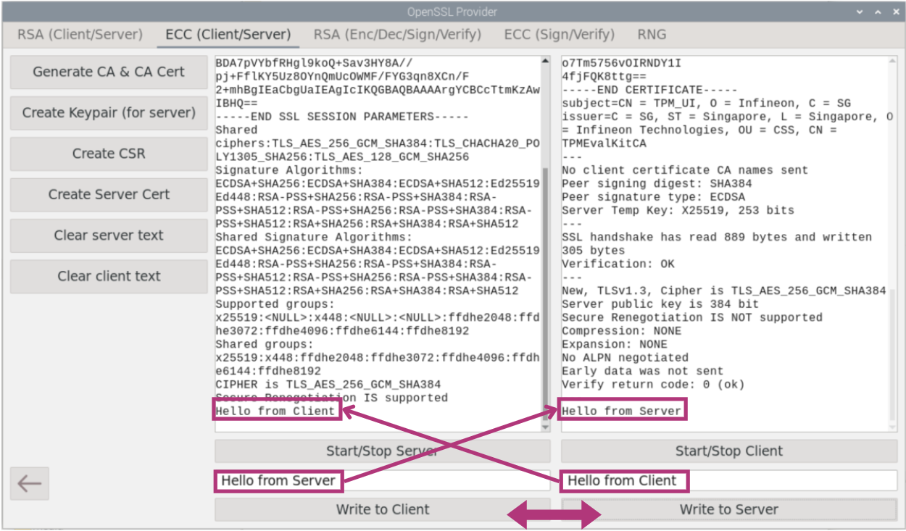 |
| ------------------------------------------------------------ |

Figure 118: OpenSSL-Engine ECC (Client/Server) Communication

To stop connection, end the server by selecting "Start/Stop Server".

|  |
| ------------------------------------------------------------ |

Figure 119: OpenSSL-Engine ECC (Client/Server) End Communication


# Data Sealing with Policy

This section shows you the Data Sealing with Policy in the OPTIGA™ TPM. It can be used to seal data using a PCR policy.

Sealing permits the key or secret to be protected not only by a password but by a policy. A typical policy locks the key to PCR values (the software state) current at the time of sealing. This assumes that the state at first boot is not compromised. Any preinstalled malware present at first boot would be measured into the PCRs, and thus the key would be sealed to a compromised software state.

## Data Sealing with Policy Function Description

Data Sealing with Policy Function Description

| 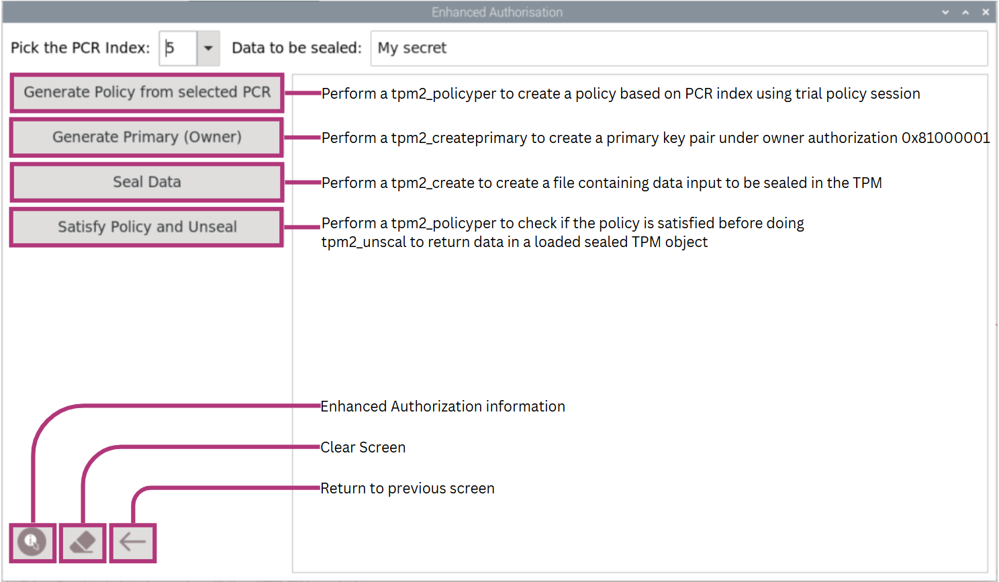 |
| ---------------------------------------------------------- |

Figure 120: Data Sealing with Policy Function Description


## Data Sealing with Policy Functions

Go back to the main screen and select "Data Sealing with Policy".

|  |
| ---------------------------------------------------- |

Figure 121: OPTIGA TPM 2.0 Explorer Data Sealing with Policy Selection

|  |
| ------------------------------------------------------------ |

Figure 122: Data Sealing with Policy Screen


### Data Sealing with Policy

Select PCR Index and generate policy by selecting "Generate Policy from selected PCR". In this example, PCR Index "5" will be used. The policy will be tied down to PCR 5 and its predefined value.

|  |
| ------------------------------------------------------------ |

Figure 123: Data Sealing with Policy Generate Policy

Select "Generate Primary (Owner)" to generate primary key under storage hierarchy and the Owner Authorization Value will be prompted. Enter the Owner Authorization Value and select "OK" to proceed.

|  |
| ------------------------------------------------------------ |

Figure 124: Data Sealing with Policy Generate Primary (Owner)

Once "OK" is selected, a primary key will be created and the handle will be persisted under the storage hierarchy.

|  |
| ------------------------------------------------------------ |

Figure 125: Data Sealing with Policy Generate Primary (Owner)

Enter an input in "Data to be sealed". Then select "Seal Data" to seal the input.

|  |
| ---------------------------------------------------- |

Figure 126: Data Sealing with Policy Seal Data

To unseal data, ensure that the PCR Index is correct and select "Satisfy Policy and Unseal".

|  |
| ------------------------------------------------------------ |

Figure 127: Data Sealing with Policy Satisfy Policy and Unseal Success

If PCR index is wrong, policy check will fail as the predefined PCR index is 5.

|  |
| ---------------------------------------------------------- |

Figure 128: Data Sealing with Policy Satisfy Policy and Unseal Failure with wrong PCR index

If PCR index is correct but value is wrong, error messages will be displayed to indicate failure as the predefined value of PCR index 5 is all '0x0000000000000000000000000000000000000000000000000000000000000000'. First, we head go to Setup and Basic Features under PCR to extend PCR index 5. Refer to Section 2.2.3 for information on extend PCR.

|  |
| -------------------------------------------- |

Figure 129: Extending PCR Index 5 with Setup and Basic Features PCR

If PCR index is correct but value is wrong, an error message that the PCR value is wrong will be shown and the policy check will fail. TPM2_unseal will not be successful.

|  |
| -------------------------------------------- |

Figure 130: Data Sealing with Policy Satisfy Policy and Unseal with right PCR index and wrong index value


# Attestation

This section shows you how to use Attestation in the OPTIGA™ TPM. A system health check supported by Infineon's OPTIGA™ TPM lets users check that their devices have not been manipulated. The TPM provides a secured identity and storage space for system control mechanisms that may check whether hardware and software are still running as intended. The system notifies the user if it does detect changes, e.g. caused by malware.

Go back to the main screen and select "Attestation".

|  |
| --------------------------------------- |

Figure 131: OPTIGA TPM 2.0 Explorer Attestation Selection

|  |
| ------------------------------------------------------------ |

Figure 132: OpenSSL-Engine Attestation Main Screen


## Attestation Function Description

A TPM attestation offers cryptographic proof of software state. The attestation is a TPM quote: a number of PCR are hashed, and that hash is signed by a TPM key known as attestation key. If the remote party can validate that the signing key came from an authentic TPM, it can be assured that the PCR digest report has not been altered. The device remote attestation supported by Infineon's OPTIGA™ TPM lets users check that their devices have not been manipulated to establish the trust in the devices.

| 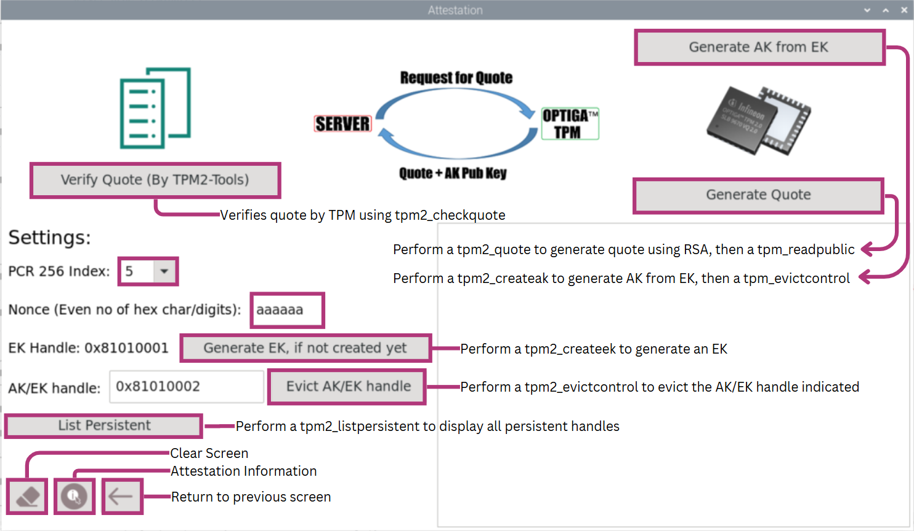 |
| ------------------------------------------------------ |

Figure 133: Attestation Function Description


## Generating Quote

To generate a signing key, AK will be required. An AK can be generated from an EK. If an EK has not been generated, select the button “Generate EK, if applicable” to generate an endorsement key using RSA. 

|  |
| --------------------------------------------------------- |

Figure 134: Attestation Select Generate EK

Enter the set value of the Owner Authorization Value and select “OK” to create Generate EK.

|  |
| ------------------------------------------------- |

Figure 135: Owner Authorization confirmation for generating EK

Enter the set value of the Endorsement Authorization Value and select “OK” to create Generate EK.

|  |
| ------------------------------------------------------- |

Figure 136: Endorsement Authorization confirmation for generating EK

EK will be successfully generated.

|  |
| ------------------------------------------------------ |

Figure 137: EK Generated

Then, select “Generate AK from EK” to generate Attestation Keypair from the Endorement Key.[[LN(DSAEI1/]](#_msocom_1) 

|  |
| ------------------------------------------------------------ |

Figure 138: Attestation Select Generate AK from EK

Enter the set value of the Owner Authorization Value and select “OK” to Generate AK from EK.

|  |
| ------------------------------------------------------------ |

Figure 139: Owner Authorization confirmation for generating AK from EK

Enter the set value of the Endorsement Authorization Value and select “OK” to Generate AK from EK.

|  |
| ------------------------------------------------------------ |

Figure 140: Endorsement Authorization confirmation for generating AK from EK

AK will be successfully generated.

|  |
| ------------------------------------------------------------ |

Figure 141: AK Generated

Configure the "PCR 256 Index" to the index you wish to perform the signing. In this example, we will use PCR Index 5.

Next, Select the button "Generate Quote". The PCR is signed by TPM attestation key. The Nonce used in this specific example to generate quote will be "9e0c6f", an even number of hexadecimal symbols and will be converted into a byte array, but in real life application, the nonce will be a random or pseudo-random number issued in an authentication protocol to ensure that old communications cannot be reused in replay attacks.

|  |
| --------------------------------------------------------- |

Figure 142: Attestation Generate Quote


## Verifying Quote

To verify quote using OpenSSL, select "Verify Quote (OpenSSL)". A "Verified OK" message will be displayed upon success. To verify quote using TPM2 Tools, select "Verify Quote (TPM)". A command tpm2_checkquote will be issued to check for discrepancies from the generation of quote and no error messages will be displayed if successful. RSA Signature will be checked during verification.

|  |
| ---------------------------------------------------------- |

Figure 143: Attestation Verify Quote with OpenSSL and TPM2 Tools Success

For the Attestation verification for Quote of (TPM), in this example of the TPM Explorer, the "Nonce" is changed to be "aaaaaabb". If the server uses a difference "Nonce" than the one used during quote generation "9e0c6f", error messages will be displayed to indicate failure.

|  |
| --------------------------------- |

Figure 144: Attestation Verify Quote TPM Failure


## Evict AK/EK Handle

If you need to evict AK/EK Handle in order to make space for more persistent handles, input the handle to evict correctly and select "Evict AK/EK handle".

|  |
| ------------------------------------------------- |

Figure 145: Attestation Evict AK/EK Handle

Enter the set value of the Owner Authorization Value and select “OK” to Evict AK/EK Handle.

|  |
| ------------------------------------------------------- |

Figure 146: Owner Authorization confirmation for Evicting AK/EK handle

Persistent-handle: 0x81010002 should be successfully evicted.

|  |
| ------------------------------------------------- |

Figure 147: Evicting AK/EK handle Success


# Secured connection to AWS IoT core using TPM2.0

AWS IoT core makes use of X.509 certificates to authenticate client or device connections during a registration and onboading attempt.

The "Application: Cloud Connectivity" demo example showcases how to set up trusted connection to AWS IoT core using X.509 with a TPM2.0 private key. The demo software was developed using the AWS IoT Device SDK for Embedded C, integrating OPTIGA™ TPM2.0 into the platform.

This section explains the following steps required to run the demo
1.  Get started with AWS IoT core
2.  Create device certificate and assign it to Thing with policy
3.  Publish messages to AWS IoT core from the Raspberry Pi

Go back to the main screen and select "Application: Cloud Connectivity".

|  |
| ---------------------------------- |

Figure 148: OPTIGA TPM 2.0 Explorer Application: Cloud Connectivity Selection

|  |
| ------------------------------------------------- |

Figure 149: AWS Cloud Connectivity Main Screen


## Get started with AWS IoT Core

To generate "Access Key ID" and "Secret Access Key", log in to AWS IOT.

|  |
| -------------------------------------------------------- |

Figure 150: AWS IOT Login

Next, go to your security credentials.

|  |
| ----------------------------------------------------------- |

Figure 151: AWS IOT Security Credentials

Download your security credentials.

|  |
| ------------------------------------------------------------ |

Figure 152: AWS IOT Download Security Credentials


|  |
| --------------------------------------------------- |

Figure 153: Security_Credentials.CSV


To retrieve Endpoint, go to "Services" and select "IOT Core".

|  |
| ------------------------------------------------------------ |

Figure 154: AWS IOT Core

Select "Settings" at the left side of the webbrowser.

|  |
| ------------------------------------------------------------ |

Figure 155: AWS IOT Core Settings

At "Custom Endpoint", copy the endpoint.

|  |
| --------------------------------------------------- |

Figure 156: AWS IOT Core Settings Endpoint

Input the "Access Key ID" and "Secret Access Key". Key in the Session Token strings for device that log in using SSO.

|  |
| ------------------------------------------- |

Figure 157: AWS IOT Configuration

Configure the region to according to the endpoint that you have chosen and select "Set AWS credentials".

|  |
| -------------------------------------------- |

Figure 158: AWS IOT Set AWS Credentials Selection

**Skip this step if a policy file has already been created.** First, select "Open policy file", make no changes and save. This is a one time setting only.

|  |
| --------------------------------- |

Figure 159: AWS IOT Open Policy File Selection

|  |
| --------------------------------------------------- |

Figure 160: AWS IOT Policy File

Next, set Endpoint by selecting "Open config file".

|  |
| --------------------------------- |

Figure 161: AWS IOT Open Config File Selection

Paste the endpoint from the custom endpoint copied from AWS IOT Core Settings Endpoint, specify the policy name if there is already one in your AWS IoT Core and save.

|  |
| ---------------------------------------- |

Figure 162: AWS IOT Open Config File

Select "Create Policy (from policy file)". Skip this step if policy has been created before.

|  |
| ----------------------------------------- |

Figure 163: AWS IOT Create Policy Selection


## Create device certificate and assign it to Thing with policy

Once configuration is done, to provision the certificate, select "1-click provision". Step 1 to Step 6 will be run and a certificate will be generated after receiving the CSR based on keys generated in the TPM, using AWS IoT's certificate authority.

The following code will be run for Step 1 to Step 6.

```
Step 1: Generate a new key pair from TPM2.0 and export the public key.

(/'/>/>/>/',/'tpm2tss-genkey -o owner123 -a rsa rsa.tss/')

Step 2: Generate a Certificate Signing Request

(/'/>/>/>/', u/'openssl req -new -config temp.conf -engine tpm2tss -key rsa.tss -keyform engine -subj/CN=AWS_IoT_TPM_Certificate/O=Infineon_Technologies/C=SG/ST=Singapore -out leaf.csr/')

Step 3: Create AWS IoT Thing

(/'/>/>/>/', u/'aws iot create-thing/--thing-name TPM_UI_Demo/')

Step 4: AWS IoT constructs a new certificate based on the CSR and signs it with the ATS endpoint CA

(/'/>/>/>/',/'aws iot create-certificate-from-csr/--certificate-signing-request file://leaf.csr/--set-as-active/--certificate-pem-outfile leafAWS.crt/')

Step 5: Attach AWS IoT Certificate to AWS IoT Thing

(/'/>/>/>/', u/'aws iot attach-thing-principal/--thing-name TPM_UI_Demo/--principal arn:aws:iot:us-east-2:065398228892:cert/2e3ee116ee7927525e106b3a9579e83e6b879921200fcf056d132be3ea42d623/')

Step 6: The policy is attached to the received certificate

(/'/>/>/>/', u/'aws iot attach-policy/--policy-name IoT_Publish_Subscribe/--target arn:aws:iot:us-east-2:065398228892:cert/2e3ee116ee7927525e106b3a9579e83e6b879921200fcf056d132be3ea42d623/')
```

|  |
| ------------------------------------------------- |

Figure 164: AWS IOT 1-click provision Selection

1-click provision is successful if no error message is seen and certificate is successfully attached as shown in Figure 165. Data can now be sent to AWS webbrowser.

|  |
| ----------------------------- |

Figure 165: AWS IOT 1-click provision Succeeded


## Publish messages to AWS IoT core from the Raspberry Pi

After performing all the necessary preparation steps from Step 1 to Step 6, we will set up the topic for the AWS webbrowser for the TPM Explorer to publish the data to. Return to the AWS IOT webbrowser. Select "Test" on the left tab. Then enter "pulsioximeter" and select "Subscribe".

|  |
| ------------------------------- |

Figure 166: AWS IOT Test

We can proeed with Step 7. On the OPTIGA™ TPM Explorer AWS IOT, input the correct Topic and the intended Data. Then, select "Start Publishing". The device can continue publishing even after reboot and no further configuration will be required.

|  |
| ------------------------------- |

Figure 167: AWS IOT Start Publishing Selection

On the AWS IOT webbrowser, subscription to "pulsioximeter" should be shown and an update of the data will be published as shown in Figure 168. This example can be used in many other real time applications where the data can be continuously published to the AWS Iot webbrowser.

|  |
| ---------------------------------- |

Figure 168: AWS IOT WebBrowser Successfully Published


## <a name="references"></a>References

1.  <https://downloads.raspberrypi.org/raspios_armhf/images/raspios_armhf-2022-09-26/>
2.  <https://www.infineon.com/cms/en/product/evaluation-boards/iridium9670-tpm2.0-linux/>
3.  <http://www.infineon.com/tpm>
4.  https://trustedcomputinggroup.org/resource/tpm-main-specification/
5. <https://www.infineon.com/cms/en/product/evaluation-boards/optiga-tpm-9672-rpi-eval/>


